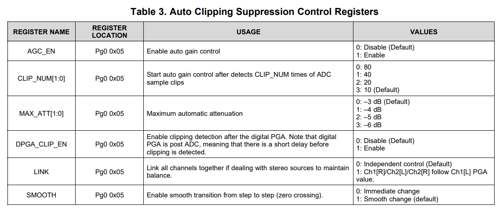
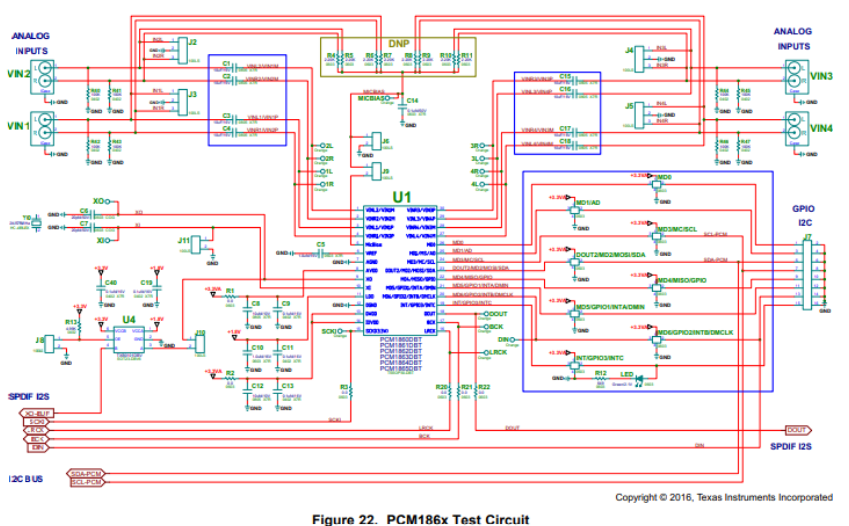
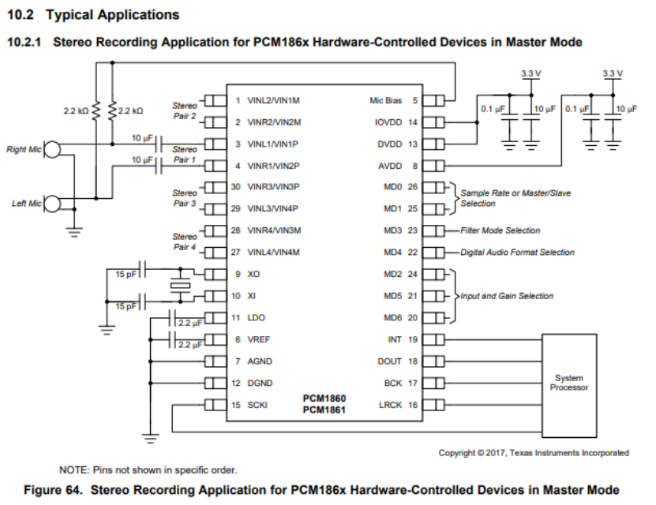
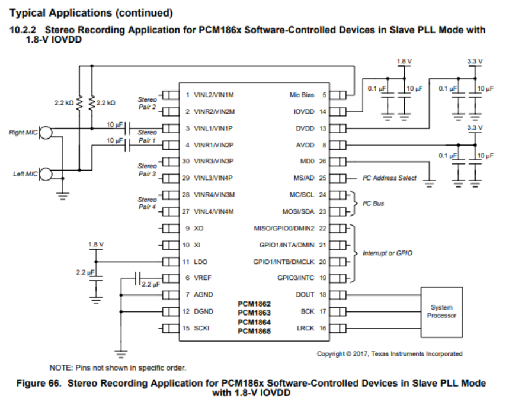
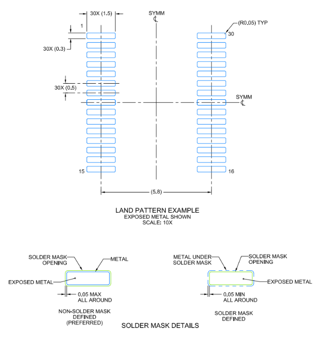

# PCM1863 ADC
The [PCM1863](https://www.ti.com/product/PCM1863?utm_source=google&utm_medium=cpc&utm_campaign=asc-null-null-GPN_EN-cpc-pf-google-wwe&utm_content=PCM1863&ds_k=PCM1863&DCM=yes&gclid=Cj0KCQiA6fafBhC1ARIsAIJjL8l6Lk9SO-Q0-fB0_5uYiveTayMeogbHzMJUxCBsQcNd4n_-5XY2ie4aAl2cEALw_wcB&gclsrc=aw.ds) is an audio-controlled analog-to-digital (ADC) converter. The chip is 110dB 2-channel software controlled. The chip is made by Texas Instruments (TI), and its datasheet is available here: [PCM1863 Datasheet](https://www.ti.com/lit/ds/symlink/pcm1861-q1.pdf?HQS=dis-dk-null-digikeymode-dsf-pf-null-wwe&ts=1676585219889&ref_url=https%253A%252F%252Fwww.ti.com%252Fgeneral%252Fdocs%252Fsuppproductinfo.tsp%253FdistId%253D10%2526gotoUrl%253Dhttps%253A%252F%252Fwww.ti.com%252Flit%252Fgpn%252Fpcm1861-q1).

The chip is a TSSOP (DBT) 30 pin package. The chip is hardware and software controllable.

Drivers for the PCM 186x series are available [here](https://e2e.ti.com/support/audio-group/audio/f/audio-forum/773056/faq-linux-drivers-device-drivers-for-aic31xx-dac31xx-aic325x-aic320x-aic326x-aic321x). More driver information can be found on the [TI webpage](https://www.ti.com/product/PCM1863?utm_source=google&utm_medium=cpc&utm_campaign=asc-null-null-GPN_EN-cpc-pf-google-wwe&utm_content=PCM1863&ds_k=PCM1863&DCM=yes&gclid=Cj0KCQiA6fafBhC1ARIsAIJjL8l6Lk9SO-Q0-fB0_5uYiveTayMeogbHzMJUxCBsQcNd4n_-5XY2ie4aAl2cEALw_wcB&gclsrc=aw.ds) for the PCM1863.

Here is a block diagram of the chip we are using:

---

In our project, we are using the PCM1863 as an analog-to-digital (ADC) converter. The goal of the chip is to take analog input, and change the signal into a readable I2C output.

### Inputs (mono only):
Inputs can have a voltage from [0, 2.1Vrms] in single mode and [0, 4.2Vrms] in differential mode. The ADC can give quality output at inputs as small as millivolt microphone inputs.

The chip has two primary ADCs that can be used for stereo audio (for a total of four mono inputs). The chip has a secondary ADC that can be used for low power voltage monitoring and interrupts.

The chip can support up to two microphones (analog or digital). Analog inputs are directed through Vin while digital microphones are directed through GPIO.

The chip supports two digital microphones using GPIO1 as data input and GPIO2 as a clock. The recommended clock frequency is 2.8224MHz (44.1kHz * 64). The recommended sampling frequency is 44.1kHz where SCK is 256 * the sampling frequency. We are leaving the auto clock detector enabled for digital microphones.

Input gains are selectable as a range from [-12dB, 32dB] in intervals of 0.5dB. Digital mixing can offer up to 18dB. Coarse gain is done with analog amplification while fine gain is done with digital amplification. *Microphones primarily use 20dB gain amplification, so we will use 20dB gain.* *Changing gain requires the on-chip DSP to be clocked.* Clocking without a master does not work without an external oscillator. Gain clipping is auto-detected and corrected, or an interrupt can be enabled and sent to a GPIO output. Attenuation can be programmed to -3dB, -4dB, -5dB, or -6dB.

Microphone bias can power electret microphones. Input 2.6V to pin 5 (MIC BIAS). Decouple and filter the power. An on-chip terminating resistor (to GND) can be enabled by writing to the *MIC_BIAS_CTRL (0x15)* register. The default is to bypass the onboard terminating resistor.

DC blocking capacitors are used for all analog input signals. The pins are biased to AVDD / 2. *Do not connect unused analog input pins.*

Types of inputs:
- Control voltage (CV) at 5V stepped down.
- 3.5mm Headphone jack.
- Guitar or bass (through adapter into a 3.5mm jack)

## Outputs:
- Digital I2C signal
- Other configurable outputs are not used for our project.

## Clocking:
**In follower mode, all clocks must be supplied externally.** The chip's master clock (MCK) must be of the form 2^n power of the sampling frequency. The chip's bit clock (BCK) should be running at 64 * sampling frequency. The word clock (left-right clock, LLRCK) determines the sampling point for the ADC. The chip must have its phase lock loop (PLL) programmed to generate audio clocks, but any incoming clock in the range [1MHz, 50MHz] will work.
- 12MHz clock is recommended for 44.1kHz sampling
- 192kHz sampling is only supported if using a CMOS oscillator (we are not using)
- DSP1 and DSP2 should be 256 * sampling frequency

We will be using the ADC is follower mode. The PLL will automatically detect for standard audio sampling rates. The clocking modes are shown below:

# TODO: what is our master clock speed? What is our bit clock speed? What is our LLRCK speed? What are DSP1 and DSP2?

---
# Registers:

### Input Selection:
Inputs can be mixed using the ADC input selection register *ADCX1_INPUT_SEL_X (0x06 --> 0x09).* Mixing left and right sources to create mono mixes can only be done in the digital mixer, post ADC conversion, or alternatively, other analog inputs can be connected for mixing. Here is a table describing possible mixes. [SE] represents single-ended where [DIFF] represents a differential input.

**ADCX1_INPUT_SEL_X:**

### Channel Linking:
Stereo inputs should be linked and tracked across input channels.

# TODO: do we want linking for our mono inputs?

### Clock sources:
- *CLK_MODE (0x20):* Clock selection. Bits [5:7] configure the OR and MUX for the master clock (MCLK).
- *MST_MODE (0x20):* Set master or follower mode. Bits [1:3] sets clock sources for ADC, DSP1, and DSP2. *We ignore these, and use the default settings.*
- *MST_SCK_SRC (0x20):* Sets the source of the SCKO in master mode. *We are using the chip in follower mode, so we are ignoring this register.*
- *CLKDET_EN (0x20):* **Set the auto clock detector bit to true. This step is important!**

---
# PCB Creation:
Our ADC board centers around the PCM1863, but contains other peripherals. This section will discuss the design decisions for the PCM1863 and peripherals.

Here is the current KiCad 3D model for our PCB: 

Here is the current KiCad schematic for our PCB: 

## The PCM1863 chip:
The PCM1863 has 30 pins. 

**Of the 30 pins, 12 are analog and 18 are digital.** The chip is split into a digital and an analog part so the noisy digital powers and signals do not interfere with the sensitive analog signals.

---

### Example layouts:
Below are several example circuits given in the Ti datasheet:

---
### PCM1863 Pins and components:
This section will detail decisions made regarding the components connected to the PCM1863.

**Vin:**
The PCM1863 is able to handle 4-channels of analog inputs. There is a right and a left for each input. We are using mono not stereo audio.

### PCM1863 Pinout:
**1  - VINL2/VIN1M:** Analog input 2, L-channel (or differential M input for input 1)

**2  - VINR2/VIN2M:** Analog input 2, R-channel (or differential M input for input 2)

**3  - VINL1/VIN1P:** Analog input 1, L-channel (or differential P input for input 1)

**4  - VINR1/VIN2P:** Analog input 1, R-channel (or differential P input for input 2)

**5  - Mic Bias:** Microphone biased output
- # TODO: why 2.6V and 4mA recommended

**6  - VREF:** Reference voltage output decoupling point (typically, 0.5 AVDD)
- Connect 1-µF capacitor from this pin to AGND.

**7  - AGND:** Analog ground

**8  - AVDD:** Analog power supply (typically, 3.3 V)
- Connect 0.1-µF and 10-µF capacitors from this pin to AGND.

**9  - XO:** Crystal oscillator output

**10 - XI:** Crystal oscillator input or master clock input (1.8-V CMOS signal)

**11 - LDO:** Internal low-dropout regulator (LDO) decoupling output
- Connect 0.1-µF and 10-µF capacitors from this pin to DGND.
- Can connect external 1.8V input to bypass LDO, and put the device in power saving mode.

**12 - GDND:** Digital ground

**13 - DVDD:** Digital power supply (typically, 3.3 V)
-  Connect 0.1-µF and 10-µF capacitors from this pin to DGND.

**14 - IOVDD:** Power supply for I/O voltages (typically, 3.3 V or 1.8 V)
- Connected to DVDD (3.3V)
- # TODO Do I want to connect this to LDO to get 1.8V power for I/O components?

**15 - SCKI:** CMOS level (3.3 V) master clock input

**16 - LRCK:** Audio data word clock (left right clock) input/output
- Schmitt trigger input has an internal pull-down of 50kOhms

**17 - BCK:** Audio data bit clock input/output
- Schmitt trigger input has an internal pull-down of 50kOhms

**18 - DOUT:** Audio data digital output

**19 - GPIO3/INTC:** GPIO 3 or interrupt C

**20 - GPIO2/INTB/DMCLK:** GPIO 2, interrupt B, or digital microphone clock output

**21 - GPIO1/INTA/DMIN:** GPIO 1, interrupt A, or digital microphone input

**22 - MISO/GPIO0/DMIN2:** In I2C mode: *GPIO0*
- Chip is set to I2C not SPI mode.

**23 - MOSI/SDA:** In I2C mode: *SDA*
- Chip is set to I2C not SPI mode.

**24 - MC/SCL:** Serial bit clock

**25 - MS/AD:** In I2C mode: *address pin*
- Chip is set to I2C not SPI mode.

**26 - MD0:** Control method select pin
- High = SPI
- Low (or unconnected) = I2C

**27  - VINL4/VIN4M:** Analog input 4, L-channel (or differential M input for input 4)

**28  - VINR4/VIN3M:** Analog input 4, R-channel (or differential M input for input 3)

**29  - VINL3/VIN4P:** Analog input 3, L-channel (or differential P input for input 4)

**30  - VINR3/VIN3P:** Analog input 3, R-channel (or differential P input for input 3)

### Chip ratings:
**AVDD:** 3.3V

**DVDD:** 3.3V

**IOVDD:** 3.3V

**XI:** 1.8V

**VIN:** -1.7V to 5.0V

**Current:** MAX of 31mA

**Power:** MAX of 117.3mW

### Timing requirements for I2C control interface:
The PCM1863 has two I2C modes: *fast and standard*. If one number is given, the number is the minimum acceptable value. If two values are given, they are given in the form [MIN, MAX] acceptable values. **We will be using standard mode.** Both fast and standard modes follow the same timing constraints as show in the timing diagram:

***STANDARD MODE:***

**cB:** Capacitive load for SDA and SCL lines - MAX 400pF

**vNH:** Noise margin at high level for each connected device - 0.2VDD

**fSCL:** SCL clock frequency - MAX 100kHz

**tBUF:** Bus free time between STOP and START conditions - 4.7us

**tLOW:** Low period of the SCL clock - 4.7us

**tHI:** High period of the SCL clock - 4us

**tRS-SU:** Setup time for repeated START condition - 4.7us

**tS-HD:** Hold time for START condition - 4us

**tRS-HD:** Hold time for repeated START condition - 4us

**tD-SU:** Data setup time - 250ns

**tD-HD:** Data hold time - [0, 900ns]

**tSCL-R:** Rise time of SCL signal - [(20 + 0.1cB)ns, 1000ns]

**tSCL-R1:** Rise time of SCL signal after a repeated START condition and after an acknowledge bit- [(20 + 0.1cB)ns, 1000ns]

**tSCL-F:** Fall time of SCL signal - [(20 + 0.1cB)ns, 1000ns]

**tSDA-R:** Rise time of SDA signal - [(20 + 0.1cB)ns, 1000ns]

**tSDA-F:** Fall time of SDA signal - [(20 + 0.1cB)ns, 1000ns]

**tP-SU:** Setup time for STOP condition - 4us

**tSP:** Pulse duration of spike suppressed -  MAX 50ns

---

**Timing information for master vs. follower modes:**

*We will be using follower mode.*

### PCM1863 Suggested landing pattern:
The Ti suggested landing pattern for the chip and its TSSOP30 package:

- 
- 

## Peripherals;
