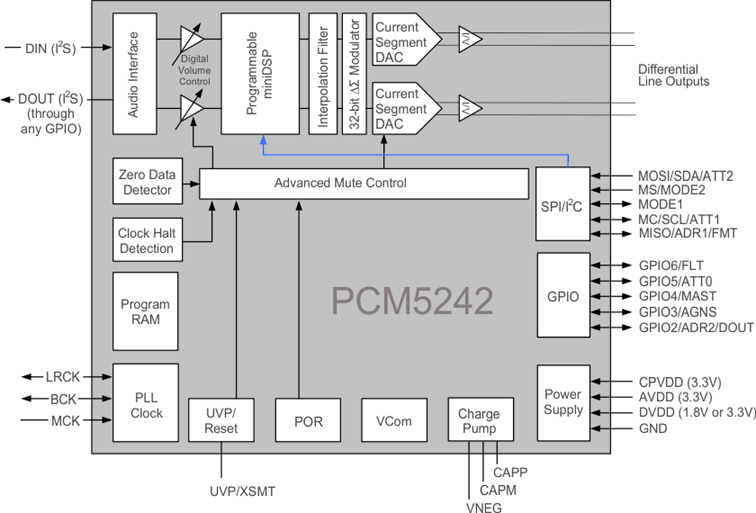
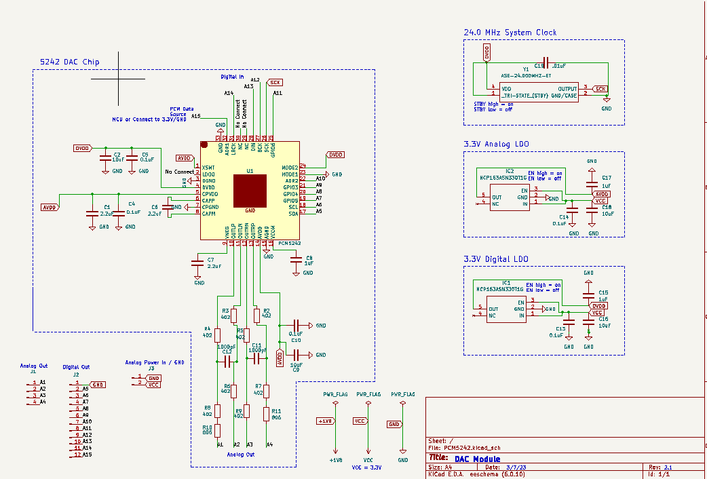

# PCM 5242

The [PCM5242](https://www.ti.com/product/PCM5242) is a 32-bit stereo DAC IC chip. Its datasheet can be found and downloaded [here](chameleon-PCB/PCM5242/pcm5242.pdf).

Here is a block diagram of the 5242 (taken from the datasheet):

The chip is capable of several sophisticated DSP processess organic to itself, but that is not what we are going to use it for in this project. 
More details about why and how we are using this chip are to follow. We will start with the basic outline of the chip to a level of understanding that you will need to operate it, and then move into details about how exactly it is used in this application. At the end of this document, you will be able to use the 5242 with the Chameleon to achieve your audio-processing goals.

# Inputs

# Outputs

# Clocking

# PCB Design Details

