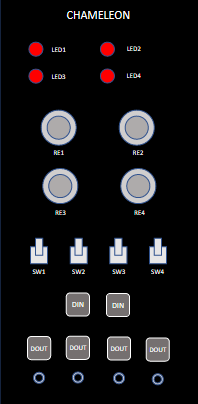
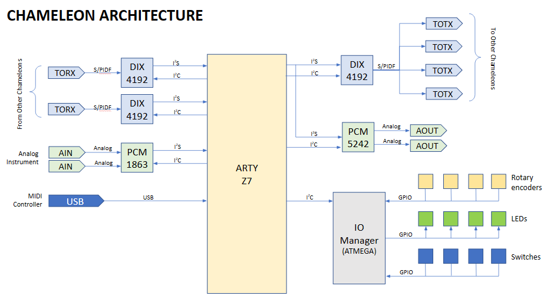

# University of Washington Engine Chameleon Team 2023
This repo documents the University of Washington ENGINE 2023 Chameleon Team's journey towards creating a digital, modular synthesizer - a **Chameleon**. The team consists of Todd Bloom, Max Chastain, Nathan Ford, Julian James, and Trina Kha. The mentor for the project is Eric Klavins.

Each individual component of the project has its own README.md file. The instructional files are:
- [PCM1863 ADC](https://github.com/jelkinsjames/chameleon-PCB/tree/main/PCM1863/README.md)
- [PCM5242 DAC](https://github.com/jelkinsjames/chameleon-PCB/blob/main/PCM5242/README.md)

Eric Klavins hosts GitHub repos with the software used for the project. The software is Yet Another Synthesizer Engine (YASE). Links to relevant repos are provided below:
- [yase](https://github.com/klavins/yase.git): The synthesizer engine used in the project.
- [yase-template](https://github.com/klavins/yase-template.git): The template .makefile to be used when installing YASE.
- [potato-recipies](https://github.com/klavins/potato-recipies.git): Instructions on how to install and use YASE on Le Potato (an alternate board similar to a Raspberry Pi).
- [arty-z7-20-recipies](https://github.com/klavins/arty-z7-20-recipes.git): Instructions on how to install and use YASE on an ARTY-Z7-20 (an alternate board similar to a Raspberry Pi).

## Project Overview:

The Chameleon can function as a waveform generator, filter, effect, sequencer, and any other programmable module.

The **user interface** includes: *four LEDs, four rotary encoders, and four toggle switches.*

The **inputs** are: *Two stereo S/PDIF inputs* to take incoming data from other Chameleons and *two line-level mono-analog audio inputs.*

The **outputs** are: *Four stereo S/PDIF outputs* (carrying the same signal) that can be connected to other Chameleons and *two line-level mono-analog audio outputs.*

---

## Block Diagram:

### ARTY-Z7:
- [Xilinx Zynq 7020 SoC Processor](https://digilent.com/shop/arty-z7-zynq-7000-soc-development-board/)
- 650 MHz Dual core ARM processor
- 85,000 cell FPGA
- [Xilinx I2S FPGA module](https://www.xilinx.com/products/intellectual-property/audio-i2s.html)
- Four stereo channels that can be input or output
- 24-bit data at a frequency to be determined
- We are not sure if two I2S modules can be implemented. If so, we can have more I/O

The Chameleon Module sits on top of the ARTY board, which has female pin headers in the shape of an Arduino shield.

### Digital Inputs and Outputs (I/O):
- Each S/PDIF signal is stereo
- Inter-Chameleon connections are stereo
- You can’t split them into two mono signals from separate Chameleons.
- Digital I/O is managed by multiple DIX4192s
- Although there are four DINs, only one can be used at a time.
- There are two I2S lines, both can be either input or output

### Analog Inputs and Outputs (I/O):
- Analog input is managed by a [PCM1863 ADC](https://www.ti.com/product/PCM1863)
- Analog output is managed by a [PCM5242 DAC](https://www.ti.com/product/PCM5242)

### Front Panel and Skins:
- Front panel is black PCB with holes for UI elements
- PCB silkscreen is used for graphics
- The front panel fits in standard [Euroracks](https://en.wikipedia.org/wiki/Eurorack)
- Laser cut "skins" can be swapped out to match current Chameleon functionality

---

## User Interface (U/I):
- The UI is managed by an [ATSAMD21](https://www.microchip.com/en-us/product/ATsamd21g18) microcontroller
- The UI has four rotary encoders, LEDs, and toggle switches
- A custom I2C protocol is used to: *query the state of encoders and switches, reset encoders, and set LEDs.*

**The I2C Protocol is Register Based:**
- Each LED and switch correspond to a single bit in a single-byte-sized register
- Each encoder has a reset bit in a half-byte-sized reset register. Setting the corresponding bit high will reset the encoder's position
- Each encoder has a position register that can be read. When read, the register gives the position of the encoder in the range [0,255].
